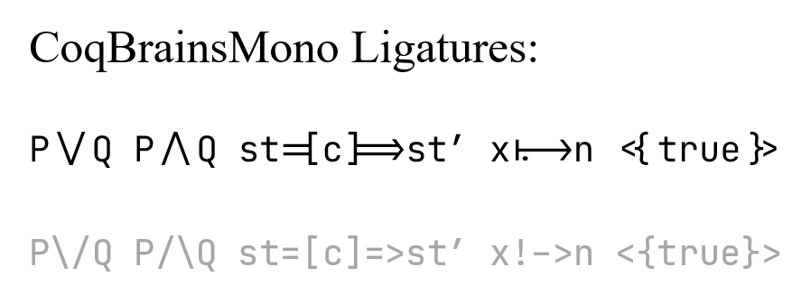

# CodeBrains Mono

基于 JetBrains Mono，为特定语言添加相应的 ligature，或删除不恰当的 ligature。与 [@Krantz-XRF](https://github.com/Krantz-XRF) 共同研究完成制作。*起因就是我们觉得 Jetbrains Mono 写 Coq 代码时候的 `\/` 和 `/\` 实在是太丑了，遂决定尝试加一下 ligature。老谢把这个取名为 CoqBrains Mono，简直绝妙！*

## Coq

Version: 0.1
Ligatures: `/\`, `\/`

